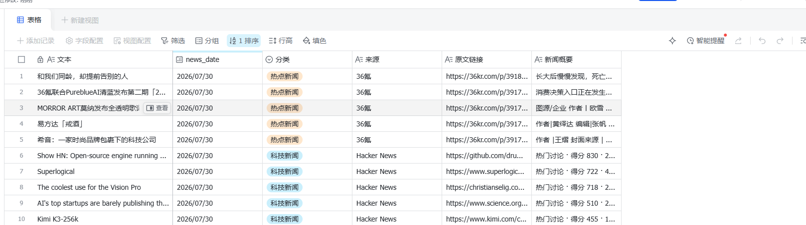

# Daily News Agent — n8n 每日新闻推送

基于 **n8n** 的自动化新闻推送工作流：每天定时从 36氪和 Hacker News 抓取新闻，通过飞书机器人推送消息卡片，同时写入飞书多维表格存档。

> ✅ 已在 **n8n 1.111.1** + **Docker Desktop (Windows 11)** 上验证通过。

---

## 效果展示

**飞书机器人消息卡片**


**飞书多维表格存档**



---

## 项目架构

```
                    ┌─ 36氪 RSS ────┐
每天 8:00 (定时触发) ─┤               ├─→ 合并新闻数据 ─┬─→ 格式化 → 飞书多维表格
手动触发（测试用）   ─┤               │                 └─→ 卡片 → 飞书机器人
                    └─ Hacker News ─┘
```

**数据流**：
1. **36氪 RSS**（`rssFeedRead`）— 抓取 36氪 RSS 订阅源，输出 5 条热点新闻
2. **Hacker News**（`httpRequest`）— 调用 Algolia API，获取首页 5 条科技新闻
3. **合并新闻数据**（`code`）— 将两路数据合并为标准格式，含标题、链接、简介
4. **格式化为表格字段**（`code`）— 转为飞书多维表格 `records` 格式
5. **写入飞书多维表格**（`feishuNode`）— 批量写入 10 条记录
6. **组装消息卡片**（`code`）— 生成飞书交互式消息卡片 JSON
7. **飞书机器人推送**（`feishuNode`）— 发送卡片消息到用户

---

## 前置条件

| 条件 | 说明 |
|------|------|
| **n8n** | 1.x 版本，Docker 或 npm 部署均可 |
| **飞书应用** | 需开通机器人 + 多维表格权限 |
| **飞书多维表格** | 提前创建好，包含指定字段（见下文） |
| **Docker**（可选） | 如果用 Docker 部署 n8n |
| **Node.js**（可选） | 如果用独立脚本运行 |

---

## 快速开始

### 第一步：创建飞书应用

1. 打开 [飞书开放平台](https://open.feishu.cn/)，创建企业自建应用
2. **添加应用能力** → 开启 **机器人**
3. **权限管理** → 添加以下权限：
   - `im:message:send_as_bot`（发送机器人消息）
   - `bitable:app`（多维表格读写）
4. **安全设置** → 添加你的服务器 IP（或直接填 `0.0.0.0/0`）
5. **版本管理与发布** → 创建版本并发布
6. 记录 **App ID** 和 **App Secret**

### 第二步：创建飞书多维表格

1. 在飞书桌面端或网页端新建一个**多维表格**
2. 创建以下字段：

| 字段名 | 类型 | 说明 |
|--------|------|------|
| 文本 | 文本 | 新闻标题 |
| 原文链接 | URL | 新闻原文链接 |
| 来源 | 文本（建议单选） | 36氪 / Hacker News |
| 分类 | 单选 | 热点新闻 / 科技新闻 |
| news_date | 日期 | 生成时间 |
| 新闻概要 | 文本 | 文章简介 |

3. 复制多维表格的 **App Token**（URL 中 `base/` 后的字符串）和 **Table ID**

### 第三步：启动 n8n

**Docker 方式**（推荐）：

```bash
docker run -d --name N8nAgent --restart unless-stopped \
  -p 5678:5678 \
  -v n8n_data:/home/node/.n8n \
  -e TZ=Asia/Shanghai \
  -e N8N_DEFAULT_TIMEZONE=Asia/Shanghai \
  n8nio/n8n:latest
```

如果 Docker Hub 不可用，可使用阿里云 ACR 镜像：
```bash
crpi-gzn62xjybihu1hgl.cn-guangzhou.personal.cr.aliyuncs.com/aai-images/n8n:latest
```

启动后访问 http://localhost:5678 完成初始设置。

### 第四步：安装飞书社区节点

在 n8n 容器内安装 `n8n-nodes-feishu-lite`：

```bash
docker exec N8nAgent npm install -g n8n-nodes-feishu-lite
docker restart N8nAgent
```

或者在 n8n 设置页面 → **Community Nodes** → 安装 `n8n-nodes-feishu-lite`

### 第五步：导入工作流

1. 下载 [`workflow-working.json`](./workflow-working.json)
2. n8n 页面 → **Import from File** → 选择该文件
3. 导入后工作流面板出现一个名为 **📰 每日新闻 → 飞书（表格 + 推送）** 的工作流

### 第六步：配置凭证和参数

**配置飞书凭证**：

1. 双击 **写入飞书多维表格** 或 **飞书机器人推送** 节点
2. 在 Credential 处点击 **Create New** → 选择 **Feishu Credential Api**
3. 填入飞书应用的 **App ID** 和 **App Secret**

**配置多维表格节点**：

1. 双击 **写入飞书多维表格** 节点
2. App Token：填入你的多维表格 App Token
3. Table ID：填入你的多维表格 Table ID

**配置机器人推送节点**：

1. 双击 **飞书机器人推送** 节点
2. Receive ID：填入接收消息的用户 Open ID
   - 个人用户：`ou_` 开头的 Open ID
   - 群聊：`oc_` 开头的 Chat ID
3. Receive ID Type：根据实际选择 `open_id` 或 `chat_id`

### 第七步：测试

点击页面底部的 **Execute Workflow** 按钮。

执行成功后：
- 飞书收到包含 10 条新闻的消息卡片
- 飞书多维表格新增 10 条记录

---

## 定时运行

工作流已配置 **每天早上 8:00** 自动触发（cron: `0 8 * * *`）。

修改方式：双击 **每天早上 8:00** 节点 → 修改 cron 表达式，例如：
- 每天早 7 点：`0 7 * * *`
- 每天早晚各一次：`0 8,20 * * *`
- 每小时：`0 * * * *`

---

## 项目文件说明

```
.
├── workflow-working.json      # 【核心】可导入 n8n 的完整工作流
├── workflow-template.json     # 原始模板（使用自定义节点，已弃用，仅供参考）
│
├── run-news.js                # 独立运行脚本（不依赖 n8n）
├── run-news.sh                # Linux/macOS 执行脚本
├── run-task.bat               # Windows 手动运行脚本
├── setup-task.bat             # Windows 定时任务配置脚本
│
├── feishu-card-template.json  # 飞书消息卡片模板（参考）
│
├── .env.example               # 环境变量模板
├── FEISHU_SETUP.md            # 飞书集成详细指南
├── RECOVERY.md                # 故障恢复指南
├── CLAUDE.md                  # 开发笔记（含踩坑记录）
│
├── doc/
│   ├── feishu-card.png        # 飞书消息卡片截图
│   └── bitable.png            # 多维表格截图
│
├── nodes/                     # 【已弃用】自定义 n8n 节点源码
├── credentials/               # 【已弃用】自定义节点凭证定义
├── icons/                     # 【已弃用】自定义节点图标
├── package.json               # 自定义节点依赖（已弃用）
└── tsconfig.json              # 自定义节点编译配置（已弃用）
```

> **说明**：项目最初设计为 n8n 自定义节点（`CUSTOM.dailyNewsAgent`），但最终方案改用 n8n **原生节点**（RSS Feed Read + HTTP Request + Code + 飞书社区节点）。`nodes/`、`credentials/` 等目录是自定义节点的遗留代码，不再需要。

---

## 独立脚本（可选）

如果想脱离 n8n 直接运行，可以使用 `run-news.js`：

```bash
cp .env.example .env
# 编辑 .env 填入飞书凭证
node run-news.js
```

Windows 定时任务：
```bash
setup-task.bat
```

---

## 常见问题

### 执行后只跑了触发节点，下游没反应？

**最常见原因：工作流节点的 `id` 和 `name` 不一致。** n8n 用 `name` 做 connections 索引，如果 `id`  ≠ `name`，下游节点不会被加入执行队列。

修复：确保每个节点的 `id` 字段值等于 `name` 字段值。

### 飞书多维表格写入报 "Field not found"

多维表格的实际列名必须与节点输出的字段名**完全一致**（区分大小写）。检查表格中是否有对应字段。

### 飞书日期字段报 "DatetimeFieldConvFail"

Date 字段必须传 **Unix 时间戳（毫秒）**，不能传 ISO 8601 字符串。`workflow-working.json` 中已正确使用 `new Date().getTime()`。

### 消息卡片只显示 5 条新闻？

检查合并节点的两路输入是否接到了**同一个输入槽**。多输入 Code 节点会每个输入执行一次，后一次覆盖前一次的结果。

### 飞书节点操作报 "未实现方法"

飞书社区节点 `n8n-nodes-feishu-lite` 的操作名使用冒号分隔格式：
- 多维表格：`bitable:table:record:batchAdd`
- 消息：`message:send`

不要使用 `batchCreateRecords` 或 `send` 这类简写。

### 国内访问 GitHub/Docker Hub 慢？

- GitHub：使用 [Watt Toolkit](https://steampp.net/) 加速
- Docker Hub：使用阿里云 ACR 等国内镜像

---

## 许可证

MIT
