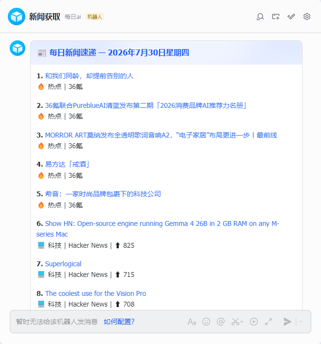

# Daily News Agent — n8n 每日新闻推送

基于 n8n 的每日新闻推送工作流，从 36氪 和 Hacker News 抓取新闻，推送到飞书多维表格和机器人消息。

✅ **已验证可用** — n8n 1.111.1 + Docker Desktop (Windows)

## 功能

- 🔥 **热点新闻** — 36氪 RSS（5 条）
- 💻 **科技新闻** — Hacker News 首页（5 条）
- 📊 **飞书多维表格** — 自动写入，含标题、链接、来源、分类、日期、概要
- 💬 **飞书机器人** — 消息卡片推送
- ⏰ **定时执行** — 每天早 8:00 自动运行

## 截图

飞书消息卡片效果：



## 快速开始

### 1. 导入工作流

1. 打开 n8n → **Import from File**
2. 选择 [`workflow-working.json`](./workflow-working.json)
3. 配置飞书凭证（App ID / App Secret）

### 2. 配置飞书节点

| 节点 | 参数 | 值 |
|------|------|-----|
| 写入飞书多维表格 | App Token | 你的多维表格 Token |
| 写入飞书多维表格 | Table ID | 你的表格 ID |
| 飞书机器人推送 | Receive ID | 你的 Open ID |

飞书配置详见 [FEISHU_SETUP.md](./FEISHU_SETUP.md)

### 3. 测试

点击 **Execute Workflow**，应收到飞书消息卡片，且多维表格中新增 10 条记录。

## 工作流结构

```
每天早上 8:00 (Schedule Trigger) ──→ 36氪 RSS ──→ 合并新闻数据 ──→ 格式化为表格字段 → 写入飞书多维表格
手动触发（测试用）        ──→ Hacker News ──┘                └─→ 组装消息卡片 → 飞书机器人推送
```

所有节点均为 n8n **原生节点**，无需安装社区节点（飞书节点例外，需安装 `n8n-nodes-feishu-lite`）。

## 多维表格字段

| 字段名 | 类型 | 说明 |
|--------|------|------|
| 文本 | 文本 | 新闻标题 |
| 原文链接 | URL | 新闻链接 |
| 来源 | 文本 | 36氪 / Hacker News |
| 分类 | 单选 | 热点新闻 / 科技新闻 |
| news_date | 日期 | 生成时间 |
| 新闻概要 | 文本 | 当日新闻概要 |

## Docker 部署

```bash
docker run -d --name N8nAgent --restart unless-stopped \
  -p 5678:5678 \
  -v n8n_data:/home/node/.n8n \
  -e TZ=Asia/Shanghai \
  -e N8N_DEFAULT_TIMEZONE=Asia/Shanghai \
  crpi-gzn62xjybihu1hgl.cn-guangzhou.personal.cr.aliyuncs.com/aai-images/n8n:latest
```

## 开发

```bash
npm install          # 安装依赖
npm run build        # 编译
node run-news.js     # 独立脚本（可选，不依赖 n8n）
```

## 常见问题

**执行后没反应 / 只执行了触发节点**
→ 检查 `workflow.json` 中每个节点的 `id` 和 `name` 是否一致。n8n 用 `name` 做 connections 索引，不一致会导致下游节点不执行。

**飞书多维表格写入报 Field not found**
→ 多维表格的列名须与节点输出的字段名完全一致，区分大小写。

**飞书日期字段报 DatetimeFieldConvFail**
→ Date 字段必须传 Unix 时间戳（毫秒），不能传 ISO 字符串。

**机器人消息收不到**
→ 确认飞书应用已开启 `im:message:send_as_bot` 权限。

## 许可证

MIT
